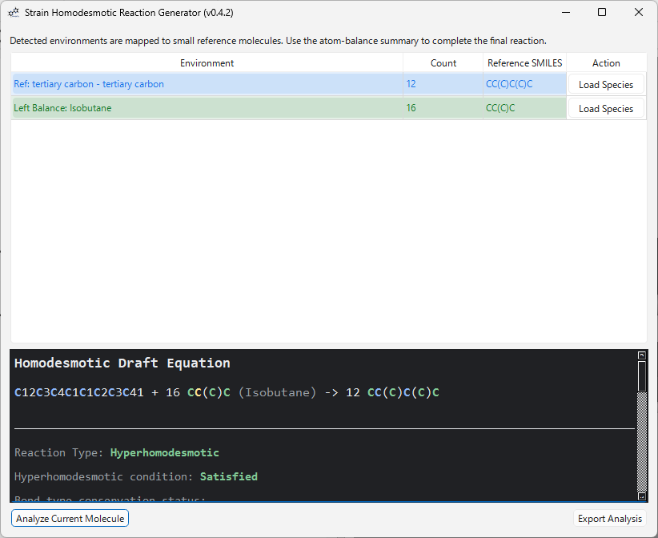

# Strain Homodesmotic Reaction Generator

[](https://doi.org/10.5281/zenodo.20725908)
[](https://github.com/HiroYokoyama/moleditpy_strain_homodesmotic_reaction_generator/actions/workflows/ci.yml)

This folder contains a MoleditPy plugin that detects common local bonding
environments in strained or highly constrained molecules and proposes small
reference molecules for draft homodesmotic or isodesmic reaction balancing.

Repo: [https://github.com/HiroYokoyama/moleditpy_strain_homodesmotic_reaction_generator/](https://github.com/HiroYokoyama/moleditpy_strain_homodesmotic_reaction_generator/)



## Features

- **Expanded Support**: Auto-detects and balances ketones, aldehydes, amines (primary, secondary, tertiary), and extended alkanes.
- **MILP Optimization**: Uses mixed-integer linear programming (MILP) via SciPy to find the optimal set of balance species.
- **Robust Fallback**: Displays a warning and falls back to simple elemental balance mode if SciPy is not installed or environment constraints prevent exact homodesmotic balancing.
- **Interactive UI**: View colored reaction equations, load reference species directly back into MoleditPy, and export results as CSV, HTML, or TXT.

## Files

- `strain_homodesmotic_reaction_generator/` - plugin directory package.
- `tests/test_analysis.py` - lightweight tests for the analysis/export logic.
- `.github/workflows/ci.yml` - GitHub Actions CI workflow configuration.

## Install

Download from MoleditPy [Plugin Explorer](https://hiroyokoyama.github.io/moleditpy-plugins/explorer/?q=Strain+Homodesmotic+Reaction+Generato). Copy `strain_homodesmotic_reaction_generator` folder into your MoleditPy user plugins directory (e.g. `~/.moleditpy/plugins/`). The plugin registers itself in the Analysis menu as **Strain Homodesmotic Reaction Generator**.

## Usage

1. Open or draw a molecule in MoleditPy.
2. Choose **Analysis > Strain Homodesmotic Reaction Generator**.
3. Click **Analyze Current Molecule**.
4. Review the detected environments, automatically generated balancing species, and any unresolved atom-balance entries.
5. Export the analysis as CSV, HTML, or text if needed. Sample report is available [here](./sample/strain_homodesmotic_reaction_draft_sample.html).

HTML export preserves the dialog color coding:

- **Blue**: original target and reference cores.
- **Yellow**: balancing cores to adjust over-counted bonds.
- **Green**: automatically added left balance species and caps.
- **Purple**: automatically added right balance species.
- **Red**: unresolved species that still need manual chemistry review.

The generated equation is a draft. The atom-balance summary shows which atoms were balanced automatically and which atoms still need additional balancing species before using quantum-chemical energies.

## Development Check

From this folder:

```bash
python -m pytest tests -v
```

The tests require RDKit and PyTest. The GUI requires PyQt6. The MILP solver requires NumPy and SciPy.

## Reference
[1] S. E. Wheeler, K. N. Houk, P. v. R. Schleyer, W. D. Allen, “A Hierarchy of Homodesmotic Reactions for Thermochemistry” *J. Am. Chem. Soc.* **2009**, *131*, 2547–2560.

## License & Disclaimer

This is open-source software distributed under the GNU GPL v3 license. It is provided 'as is' without warranty of any kind, and the author assumes no responsibility or liability for the results. Although outputs have been carefully verified, users are strongly encouraged to independently check and validate results for critical purposes (such as publications). If you encounter any bugs, please open an issue.
