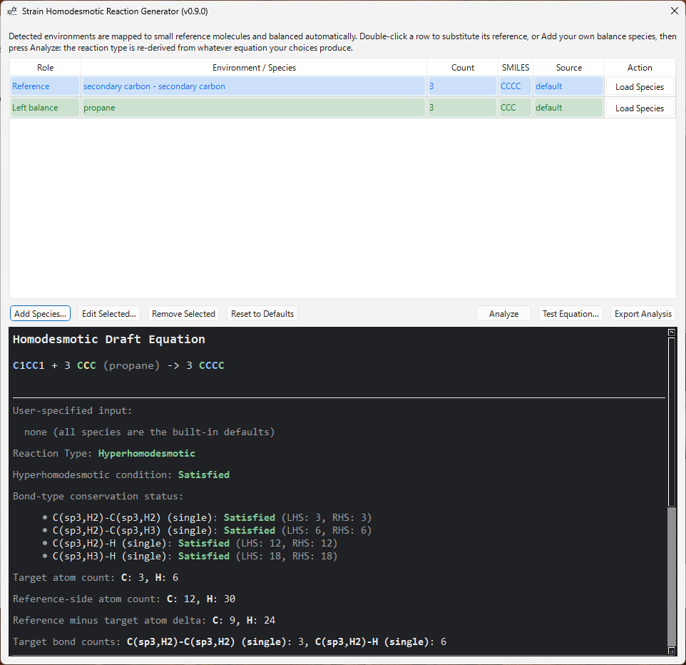

# Strain Homodesmotic Reaction Generator

[](https://doi.org/10.5281/zenodo.20725908)
[](https://github.com/HiroYokoyama/moleditpy_strain_homodesmotic_reaction_generator/actions/workflows/ci.yml)

[](https://github.com/HiroYokoyama/moleditpy_strain_homodesmotic_reaction_generator/tags)
[](https://github.com/HiroYokoyama/moleditpy_strain_homodesmotic_reaction_generator/releases)

This folder contains a MoleditPy plugin that detects common local bonding
environments in strained or highly constrained molecules and proposes small
reference molecules for draft homodesmotic or isodesmic reaction balancing.

Repo: [https://github.com/HiroYokoyama/moleditpy_strain_homodesmotic_reaction_generator/](https://github.com/HiroYokoyama/moleditpy_strain_homodesmotic_reaction_generator/)



## Features

- **Expanded Support**: Auto-detects and balances ketones, aldehydes, carboxylic acids, esters, amides and ureas, amines (primary, secondary, tertiary), ethers, and extended alkanes.
- **MILP Optimization**: Uses mixed-integer linear programming (MILP) via SciPy to find the optimal set of balance species.
- **Robust Fallback**: Displays a warning and falls back to simple elemental balance mode if SciPy is not installed or environment constraints prevent exact homodesmotic balancing.
- **Your Own Species**: Add balance species of your own, mark one **Required** to force it into the equation, override the reference molecule proposed for an environment, or exclude a species you cannot compute so the solver works around it. The reaction type is re-derived from whatever equation your choices produce, so a substitution that breaks the balance is reported as broken rather than accepted.
- **Test Equation**: Type or paste any reaction - including a line copied straight out of the report - and have it graded by the same classifier the generated draft uses, then export the verdict as HTML, CSV or TXT.
- **Interactive UI**: One table holds the whole draft - references, balance species, and any entry of yours the equation could not use. Sort by any column, load a species back into MoleditPy, and export as CSV, HTML, or TXT.

## Files

- `strain_homodesmotic_reaction_generator/` - plugin directory package.
- `tests/test_analysis.py` - lightweight tests for the analysis/export logic.
- `.github/workflows/ci.yml` - GitHub Actions CI workflow configuration.

## Install

Download from MoleditPy [Plugin Explorer](https://hiroyokoyama.github.io/moleditpy-plugins/explorer/?q=Strain+Homodesmotic+Reaction+Generato). Copy `strain_homodesmotic_reaction_generator` folder into your MoleditPy user plugins directory (e.g. `~/.moleditpy/plugins/`). The plugin registers itself in the Analysis menu as **Strain Homodesmotic Reaction Generator**.

## Usage

1. Open or draw a molecule in MoleditPy.
2. Choose **Analysis > Strain Homodesmotic Reaction Generator**.
3. Click **Analyze**.
4. Review the detected environments, automatically generated balancing species, and any unresolved atom-balance entries.
5. To use different molecules, press **Add Species...** and pick what to add:
   - **Balance species** joins the library the solver may draw on. Tick **Required** to force it into the equation.
   - **Reference molecule override** replaces the molecule proposed for one detected environment.

   Double-click a row (or select it and press **Edit Selected...**) to change it, and **Reset to Defaults** to clear everything. The cells themselves are read-only, so an edit can never silently do nothing.

   Both buttons work on the solver's own rows too:

   | Row | **Edit Selected...** | **Remove Selected** |
   |---|---|---|
   | A reference molecule | substitute it for this environment | revert to the built-in default |
   | A balance species the solver chose | adopt it as your own **Required** entry, or change the SMILES to require something else | exclude it, so the solver balances without it |
   | One of your own entries | change its SMILES, name or Required flag | drop it |
   | An excluded species | - | lift the exclusion |
6. Press **Analyze** again to apply. Changes are staged rather than applied as you type, because a full re-analysis takes seconds on a large molecule; a banner counts what is waiting.
7. Export the analysis as CSV, HTML, or text if needed. Sample report is available [here](./sample/strain_homodesmotic_reaction_draft_sample.html).

The **Source** column says where each row came from, including the ways a
request can fail quietly: `yours, cannot be placed` for a required species no
balance can use, `yours, cancelled out` for a reference the solver had to
cancel against itself (which leaves a balanced equation that no longer says
anything about that environment), and `excluded, but unavoidable` for an
exclusion that left nothing balanceable at all.

HTML export preserves the dialog color coding:

- **Blue**: original target and reference cores.
- **Yellow**: balancing cores to adjust over-counted bonds.
- **Green**: automatically added left balance species and caps.
- **Purple**: automatically added right balance species.
- **Orange**: species and references you specified yourself.
- **Red**: unresolved species that still need manual chemistry review.

Reports quote your SMILES exactly as typed, in a **User-specified input** section, alongside anything the analysis could not honour: a required species no balance could use, or a reference the solver had to cancel against itself.

The generated equation is a draft. The atom-balance summary shows which atoms were balanced automatically and which atoms still need additional balancing species before using quantum-chemical energies.

## Development Check

From this folder:

```bash
python -m pytest tests -v
```

The tests require RDKit and PyTest. The GUI requires PyQt6. The MILP solver requires NumPy and SciPy.

## Reference
[1] S. E. Wheeler, K. N. Houk, P. v. R. Schleyer, W. D. Allen, “A Hierarchy of Homodesmotic Reactions for Thermochemistry” *J. Am. Chem. Soc.* **2009**, *131*, 2547–2560.

## License & Disclaimer

This project is licensed under the GNU General Public License v3.0 (GPLv3) - see the [LICENSE](LICENSE) file for details. As open-source software, it is provided 'as is' without warranty of any kind, and the author assumes no responsibility or liability for the results. Although outputs have been carefully verified, users are strongly encouraged to independently check and validate them for critical applications (such as publications). If you encounter any bugs, please open an issue.
